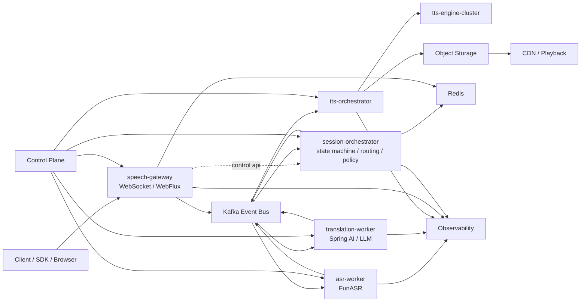

# kafka-asr

这个目录当前是一组围绕实时语音平台的专题资料页，而不是一个已经完成代码实现的工程仓库。

为了便于后续把这些资料沉淀为可执行的设计与代码，本仓库补充了一套结构化文档，统一收敛为一个目标明确的方案：

- 以 `WebFlux + Kafka + FunASR + Spring AI + TTS + Redis + K8s` 为核心技术栈
- 面向“实时语音识别 / 翻译 / TTS 回放”的生产级平台
- 以会话有序、状态外置、事件驱动、控制面与数据面分离为核心设计原则

## 当前资料来源

仓库原始内容由 7 篇 HTML 长文组成，职责大致如下：

- `FunASR 流式语音识别生产级实战...html`
  聚焦流式 ASR、VAD、chunk、cache、2-pass 和推理架构演进。
- `TTS 缓存、回放与音频分发体系...html`
  聚焦 TTS 缓存、对象存储、CDN 分发、流式合成与回放控制。
- `百万级长连接音频网关...html`
  聚焦 WebFlux、长连接网关、背压、房间/会话亲和路由。
- `从零到百万并发...html`
  作为总体架构总纲，覆盖事件流、组件选型、微服务拆分、幂等与降级。
- `从零到生产级：构建高可用的 Spring AI 实时语音翻译机器人.html`
  聚焦领域建模、状态机、依赖配置、工程结构、部署与故障治理。
- `实时语音翻译系统的可观测性与压测方法论.html`
  聚焦指标体系、SLI/SLO、压测方法和告警闭环。
- `亿级实时语音事件流：基于 Kafka 的分布式架构设计与实践.html`
  聚焦 Topic 设计、分区规划、顺序、重试、重平衡与消费模型。

## 收敛后的统一方案

建议把项目定位为“生产级实时语音翻译平台”，采用下面的总体拓扑：

核心判断：

- 实时语音链路的本质是事件流，不是单条同步调用链。
- 会话内顺序比全局顺序更重要，所有关键有序能力都应围绕 `sessionId` 设计。
- 网关只做接入和路由，不做重业务。
- 状态机、幂等、重试、降级放在编排层。
- 推理与分发是独立扩缩容单元，不要把 GPU 能力和接入层绑定在一起。
- 高频音频帧固定走 `gateway -> kafka`，编排层不做音频中转。

## 文档导航

- [docs/architecture.md](docs/architecture.md)
  总体架构、边界、数据面与控制面分层。
- [docs/event-model.md](docs/event-model.md)
  统一事件头、Topic 规划、顺序与幂等策略。
- [docs/contracts.md](docs/contracts.md)
  WebSocket 协议、错误码、版本规则与 Schema 文件入口。
- [docs/dev-workflow.md](docs/dev-workflow.md)
  `superpowers + git worktree` 的开发约定、分支命名和执行流程。
- [docs/services.md](docs/services.md)
  微服务拆分、职责边界、接口与依赖关系。
- [docs/observability.md](docs/observability.md)
  SLI/SLO、指标、链路、日志、压测与告警。
- [docs/roadmap.md](docs/roadmap.md)
  分阶段建设路线、里程碑、风险与建议目录结构。

## 推荐的下一步

- 先把本文档集作为项目主设计文档，而不是继续维护 HTML 导出页。
- 优先固化 `事件契约 + 状态机 + Topic 规划 + 服务边界`。
- 之后再进入代码仓库初始化：
  - 创建多模块工程骨架
  - 定义 API / Schema / Protobuf
  - 建立本地开发环境与最小链路
  - 逐步引入可观测性、压测和弹性扩容
