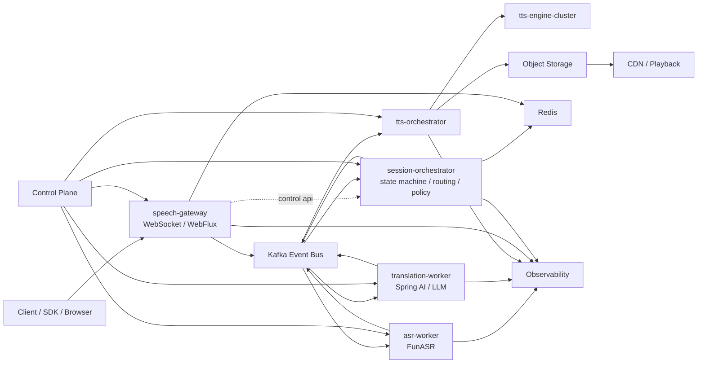

# kafka-asr

`kafka-asr` 现在不是单纯的资料收敛目录，而是一个同时包含设计文档、契约文件和 Spring Boot 服务骨架的实时语音平台仓库。

当前仓库分成三层：

- `docs/` 与 `api/`：主维护的技术事实来源。
- `services/`：当前已经落地并通过测试的实现基线。
- `docs/html/`：保留的原始长文参考资料，不再作为日常维护目标。

核心技术栈仍然围绕：

- `WebFlux + Kafka + Redis + FunASR + Spring AI + TTS + K8s`
- 会话内有序、状态外置、事件驱动
- 数据面与控制面分离

## 当前实现基线（2026-04-25）

当前仓库已经具备一条可运行的模块化骨架链路：

- `speech-gateway` 通过 `/ws/audio` 接收 `session.start`、`session.ping`、`audio.frame`、`session.stop`、`command.confirm`、`playback.metric`
- `speech-gateway` 直接发布 `audio.ingress.raw` / `command.confirm.request` 到 Kafka
- `speech-gateway` 消费 `command.result` 并回推 WebSocket 下行
- `speech-gateway` 将 `playback.metric` 直接转化为客户端播放阶段指标（`gateway.client.playback.*`）
- `speech-gateway` 通过低频 HTTP 调用 `session-orchestrator` 做 start/stop
- `session-orchestrator` 调用 `control-plane` 获取租户策略，写 Redis 会话状态，并发布 `session.control`
- `asr-worker` 消费 `audio.ingress.raw` 并发布 `asr.partial` / `asr.final`
- `translation-worker` 消费 `asr.final` 发布 `translation.request`，再消费 `translation.request` 发布 `translation.result`
- `command-worker` 消费 `asr.final`（SMART_HOME）与 `command.confirm.request`，调用 smartHomeNlu 并发布 `command.result`
- `tts-orchestrator` 按租户 `sessionMode` 分流：消费 `translation.result`（`TRANSLATION`）与 `command.result`（`SMART_HOME`），统一发布 `tts.request` / `tts.chunk` / `tts.ready`

当前详细实现状态见 [implementation-status.md](implementation-status.md)。

## 原始参考资料

7 篇 HTML 原文仍然保留在 `docs/html/`，但它们只作为历史输入和设计上下文。映射关系见 [html/README.md](html/README.md)。

当 HTML 与 Markdown / `api/` 冲突时，优先遵循：

- `docs/*.md`
- `api/protobuf/realtime_speech.proto`
- `api/json-schema/*.json`
- `services/*` 中已落地并有测试覆盖的行为

## 目标架构

核心判断：

- 实时语音链路的本质是事件流，不是单条同步调用链。
- 会话内顺序比全局顺序更重要，关键路由能力围绕 `sessionId` 设计。
- 网关只做接入和低频控制，不承担重业务编排。
- 高频音频帧固定走 `gateway -> kafka`，编排层不做音频中转。
- 推理、翻译、TTS、控制面都应独立伸缩。

## 文档导航

- [architecture.md](architecture.md)
  总体架构、当前实现基线与目标拓扑。
- [implementation-status.md](implementation-status.md)
  当前服务、接口、Topic、端口和缺口总览。
- [event-model.md](event-model.md)
  统一事件头、当前已实现 Topic 与计划扩展 Topic。
- [contracts.md](contracts.md)
  WebSocket 协议、错误码、版本规则与 Schema 入口。
- [services.md](services.md)
  服务边界、当前模块状态和依赖规则。
- [observability.md](observability.md)
  SLI/SLO、当前观测基线与后续缺口。
- [roadmap.md](roadmap.md)
  分阶段建设路线和当前阶段完成度。
- [automation.md](automation.md)
  本地脚本、CI 入口以及 `new-feature / verify / finish-feature` 的执行方式。
- [dev-workflow.md](dev-workflow.md)
  `superpowers + git worktree` 的开发约定、分支命名和执行流程。
- [superpowers-plan.md](superpowers-plan.md)
  `superpowers` 在本仓库中的实际触发顺序、边界和落地规则。
- [runbooks/manual-deployment-test.md](runbooks/manual-deployment-test.md)
  人工部署与验收 runbook（服务启动顺序、鉴权演练、预发收口与通过标准）。
- [runbooks/real-environment-collaboration.md](runbooks/real-environment-collaboration.md)
  真实环境协作 runbook（需要你提供什么、我来补什么、如何做预发/真实联调收口）。
- [runbooks/platform-dlq-replay.md](runbooks/platform-dlq-replay.md)
  统一死信重放 runbook（dry-run/apply、过滤策略、报告与失败处置）。
- [runbooks/platform-compensation-saga.md](runbooks/platform-compensation-saga.md)
  跨服务补偿 Saga runbook（replay/session-close/manual 路由、审计事件与账本）。
- [html/README.md](html/README.md)
  HTML 原始资料与当前 Markdown 文档的映射关系。

## 当前优先事项

- 验证并固化 `subtitle.partial` / `subtitle.final` / `session.closed` 的端到端体验与可靠性
- 用 `tools/downlink-e2e-smoke.sh` 固定回归检查下行链路顺序、终态和重复消息语义
- 在现有重试、DLQ、背压与限流 + 第一版幂等/补偿/熔断/灰度基础上升级为自适应治理
- 完成 ASR FunASR、Translation OpenAI 与 TTS synthesis 生产联调
- 在已接入对象存储上传基线的前提下补齐 CDN 与回放分发治理能力
- 完成告警阈值标定与通知路由，补齐压测与故障演练基线
