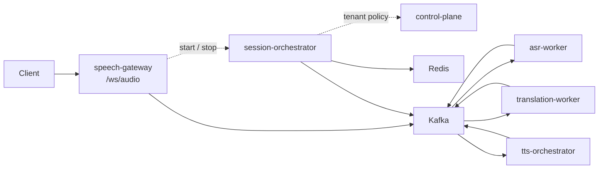
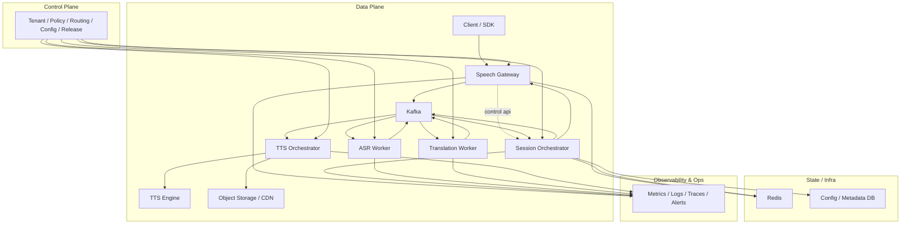

# Architecture

## 1. 目标与边界

本方案面向以下场景：

- 实时语音识别
- 实时语音翻译
- 实时字幕下发
- 流式 TTS 合成与回放
- 大规模长连接会话管理

本方案不追求：

- 所有链路都做全局强一致
- 由单一服务同时承担接入、编排、推理和分发
- 直接把 Demo 推理服务暴露给业务侧

## 2. 架构原则

- 事件驱动优先，避免同步级联调用放大延迟与故障
- 会话内有序优先，所有事件围绕 `sessionId` 和 `seq` 设计
- 数据面与控制面分离
- 状态外置，网关实例可水平扩容与迁移
- 推理服务、翻译服务、TTS 服务独立伸缩
- 可观测性默认内建，而不是上线前临时补充

## 3. 当前仓库实现基线（2026-04-24）

当前仓库已经落地的实际模块链路如下：

当前已经实现：

- `speech-gateway` 直写 `audio.ingress.raw`
- `speech-gateway -> session-orchestrator` 的低频会话控制
- `speech-gateway` 的 `session.ping` 处理
- `speech-gateway` 的可配置 WS token 鉴权、会话级限流与背压保护
- `speech-gateway` 基于 Kafka 的 `subtitle.partial` / `subtitle.final` / `tts.chunk` / `tts.ready` / `session.closed` 下行回推
- `speech-gateway` 下行链路仓库内 E2E 稳定性基线
- `session-orchestrator -> control-plane` 的租户策略查询
- `session-orchestrator` 查询 `control-plane` 的第一版熔断与缓存回退
- `session-orchestrator` 消费 `tenant.policy.changed` 刷新本地策略缓存
- `session-orchestrator` 的 Redis 会话状态与 `session.control` 发布
- `asr-worker -> translation-worker -> tts-orchestrator` 主链路已打通，并补齐 FunASR / OpenAI / HTTP synthesis 第一版生产联调基线
- `asr-worker` 的 VAD 静音切段与 `asr.partial` / `asr.final` 分流
- `tts-orchestrator` 的对象存储上传、签名 URL、CDN 区域路由与回源回退基线
- `control-plane` 的 Bearer Token 鉴权/授权、版本化 upsert/rollback、`tenant.policy.changed` 动态策略分发
- 核心 Kafka consumer 固定重试 + `.dlq` 死信回退
- 核心 Kafka consumer `idempotencyKey` 判重 + 重复失败补偿信号基线
- 观测与收口基线：Prometheus / Grafana / Alertmanager、loadtest / fault-drill / preprod closure

当前尚未实现：

- 真实依赖环境下的容量/故障演练与运行保障闭环
- 生产级结果聚合、补偿编排与自适应熔断/灰度治理
- 外部 IAM/RBAC 真实联调、数据库持久化、跨区域分发实际执行链路

## 4. 目标总体分层

## 4.1 主数据路径约束（Phase 0 冻结）

- 高频音频主链路固定为 `client -> speech-gateway -> Kafka`
- `session-orchestrator` 只消费/发布事件做编排，不中转高频音频帧
- `speech-gateway <-> session-orchestrator` 只承载低频控制交互

## 5. 关键组件职责

### Speech Gateway

目标职责：

- WebSocket / HTTP 接入
- 鉴权、限流、协议校验
- 高频音频直写 Kafka
- 字幕 / 错误 / 关闭消息回推

当前基线：

- 已实现 `/ws/audio`、WS token 鉴权、`session.ping`、音频直写 Kafka、start/stop 调用 orchestrator、错误下行，以及基于 Kafka 的字幕 / TTS / 会话关闭回推
- 未实现外部 IAM/RBAC 集成和更细粒度下行聚合策略

### Session Orchestrator

目标职责：

- 会话状态机
- 生命周期编排
- 幂等、重试、超时、降级
- 汇聚 ASR / Translation / TTS 结果

当前基线：

- 已实现 start/stop、Redis 状态、租户策略校验、控制面熔断与缓存回退、`session.control`
- 未实现结果聚合、timeout scheduler 和补偿流

### Kafka Event Bus

目标职责：

- 承接核心异步事件
- 保证会话维度顺序
- 提供缓冲、削峰和可重放能力

当前基线：

- 已承接 `audio.ingress.raw`、`session.control`、`asr.partial`、`asr.final`、`translation.result`、`tts.request`、`tts.chunk`、`tts.ready`
- 已落地消费侧固定重试、`.dlq` 死信回退、`idempotencyKey` 判重和补偿信号
- 暂未落地统一重放流程和 Lag 治理文档化闭环

### ASR Worker

目标职责：

- 流式 ASR 推理
- 管理模型上下文
- 产出 partial / final 结果

当前基线：

- 已实现默认 placeholder + 可切换 HTTP/FunASR 适配的 `audio.ingress.raw -> asr.partial / asr.final`
- 已实现会话级 VAD 静音切段触发 `asr.final`
- 已补齐 FunASR 联调基线（health 探测、并发保护、错误语义映射、引擎级指标）
- 未实现 FunASR 真机容量/故障演练与高级上下文管理

### Translation Worker

目标职责：

- 文本翻译、术语替换、上下文增强
- 下发字幕结果和 TTS 请求

当前基线：

- 已实现默认 placeholder + 可切换 HTTP/OpenAI 适配的 `asr.final -> translation.result`
- 已补齐 OpenAI 第一版生产联调基线（health 探测、并发保护、错误语义映射、引擎级指标）
- 未实现真实配额/容量治理、术语增强和上下文策略

### TTS Orchestrator

目标职责：

- 文本归一化、缓存键生成、重复请求合并
- TTS 引擎调度
- 分片或回放地址输出

当前基线：

- 已实现 `translation.result -> tts.request / tts.chunk / tts.ready`（规则 voice + 可切换 HTTP voice-policy 适配）
- 已实现 HTTP synthesis 第一版生产联调基线，以及 `tts.ready` 可配置对象存储上传、签名 URL、CDN 路由与回源回退
- 未实现真实引擎容量/故障演练、对象存储 HA 和更高级 CDN 缓存治理

### Control Plane

目标职责：

- 租户、语言对、模型版本、配额管理
- 路由、灰度和熔断配置

当前基线：

- 已实现租户策略 GET / PUT / rollback、Bearer Token 鉴权/授权、`control.auth.mode=static/external-iam/hybrid`、Redis 存储和 `tenant.policy.changed` 动态策略分发
- 已支持回滚上一版本或指定 `targetVersion`，并附带 `distributionRegions` 分发意图元数据
- 未实现数据库持久化、外部 IAM/RBAC 真实联调与跨区域分发实际执行链路

## 6. 数据面与控制面分离

### 数据面

数据面承载高频实时链路：

- 客户端连接
- 音频帧流
- 识别结果流
- 翻译结果流
- TTS 音频流

要求：

- 低延迟
- 可扩缩
- 尽量无状态
- 容错后可快速恢复

### 控制面

控制面承载低频但高价值的治理能力：

- 配置中心
- 模型版本管理
- 租户策略
- 路由规则
- 灰度与熔断开关
- 运营审计

要求：

- 配置变更可追踪
- 政策发布可回滚
- 变更影响范围可控

## 7. 关键架构决策

### 7.1 为什么不是同步串联调用

如果网关直接同步调用 ASR、翻译、TTS，会出现：

- 上游延迟直接叠加
- 某个服务抖动时整条链路阻塞
- 子链路无法独立扩缩容
- 重试语义混乱

因此主链路统一走事件驱动，只保留少量低频同步控制接口。

### 7.2 为什么状态必须外置

如果会话状态只在网关内存中，实例漂移、重启或扩容时会导致：

- 会话丢失
- 有序性失效
- 重复消费与重发难以判断

因此关键状态必须外置到 `Redis + 持久化元数据存储`。

### 7.3 为什么单独拆分 TTS 编排层

TTS 在生产里关心的不只是“合成”：

- 缓存命中率
- 重复请求合并
- 回放与分发
- 对象存储回源
- CDN 边缘命中

所以 `tts-orchestrator` 必须是一个独立编排层，而不是直接暴露模型调用。

## 8. 容量与弹性建议

- Gateway 按连接数、出入带宽、CPU、事件循环延迟扩缩容
- ASR 按 GPU 利用率、推理队列长度、单路时延扩缩容
- Translation Worker 按吞吐、延迟、第三方模型配额扩缩容
- TTS 按缓存未命中率、引擎队列、分发带宽扩缩容
- Kafka 按分区利用率、消费延迟、磁盘与网络利用率规划容量

## 9. 当前落地路径判断

面向生产的第一条闭环仍应以：

- `speech-gateway`
- `session-orchestrator`
- `Kafka`
- `asr-worker`
- `translation-worker`
- `Redis`

作为 Phase 1 的强约束基线。

仓库目前已经额外包含：

- `tts-orchestrator`
- `control-plane`

这两个模块已经不只是“骨架”，而是具备第一版生产联调/治理基线；但距离真实依赖环境下的生产闭环仍有明显差距。
