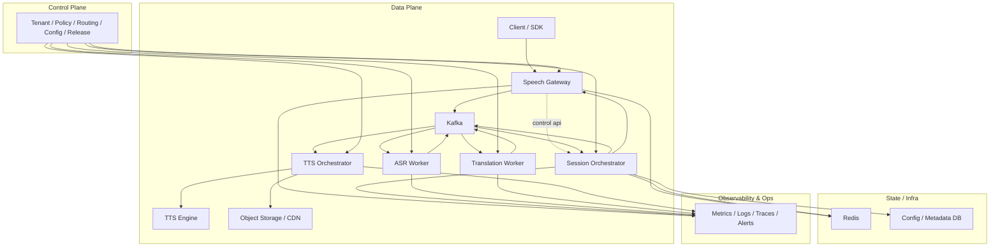

# Architecture

## 1. 目标与边界

本方案面向以下场景：

- 实时语音识别
- 实时语音翻译
- 实时字幕下发
- 流式 TTS 合成与回放
- 大规模长连接会话管理

本方案不追求：

- 所有链路都做全局强一致
- 由单一服务同时承担接入、编排、推理和分发
- 直接把 Demo 推理服务暴露给业务侧

## 2. 架构原则

- 事件驱动优先，避免同步级联调用放大延迟与故障。
- 会话内有序优先，所有事件围绕 `sessionId` 和 `seq` 设计。
- 数据面与控制面分离。
- 状态外置，网关实例可水平扩容与迁移。
- 推理服务、翻译服务、TTS 服务独立伸缩。
- 可观测性默认内建，而不是上线前临时补充。

## 3. 总体分层

## 3.1 主数据路径约束（Phase 0 冻结）

- 高频音频主链路固定为 `client -> speech-gateway -> Kafka`。
- `session-orchestrator` 只消费/发布事件做编排，不中转高频音频帧。
- `speech-gateway <-> session-orchestrator` 只承载低频控制交互（会话初始化、策略查询、状态回传）。

## 4. 关键组件职责

### Speech Gateway

- 负责 WebSocket / HTTP 接入
- 执行鉴权、限流、协议校验
- 维护连接生命周期
- 将高频音频帧直接写入 Kafka（`audio.ingress.raw`）
- 仅通过低频控制接口与 `session-orchestrator` 交互
- 根据路由策略绑定会话亲和实例

### Session Orchestrator

- 维护会话状态机
- 消费并发布会话控制、识别、翻译、TTS 事件
- 编排 ASR、翻译、TTS 的调用顺序
- 处理幂等、重试、超时与降级
- 执行租户策略和 QoS 控制

### Kafka Event Bus

- 承接核心异步事件
- 保证会话维度顺序
- 解耦接入层与推理层
- 提供缓冲、削峰和可重放能力

### ASR Worker

- 消费语音分片事件
- 管理 FunASR 流式推理上下文
- 产出 partial / final 识别结果
- 暴露模型级指标和 GPU 指标

### Translation Worker

- 接收 final 或半稳定文本
- 执行翻译、术语替换、上下文增强
- 下发字幕结果和 TTS 请求

### TTS Orchestrator

- 做文本归一化和缓存键生成
- 合并重复请求
- 决定命中缓存、调用引擎或回放对象存储
- 统一产出分片音频或播放地址

### Control Plane

- 管理租户、语言对、模型版本
- 管理限流、灰度、路由和降级开关
- 提供配置与治理入口

## 5. 数据面与控制面分离

### 数据面

数据面只承载高频实时链路：

- 客户端连接
- 音频帧流
- 识别结果流
- 翻译结果流
- TTS 音频流

要求：

- 低延迟
- 可扩缩
- 尽量无状态
- 容错后可快速恢复

### 控制面

控制面承载低频但高价值的治理能力：

- 配置中心
- 模型版本管理
- 租户策略
- 路由规则
- 灰度和熔断开关
- 运营审计

要求：

- 配置变更可追踪
- 政策发布可回滚
- 变更影响范围可控

## 6. 关键架构决策

### 6.1 为什么不是同步串联调用

如果网关直接同步调用 ASR、翻译、TTS，会出现：

- 上游延迟直接叠加
- 某个服务抖动时整条链路阻塞
- 难以针对不同子链路独立扩缩容
- 重试语义混乱

因此建议统一走事件驱动，必要时仅保留少量同步控制接口。

### 6.2 为什么状态必须外置

如果会话状态只在网关内存中，实例漂移、重启或扩容时会导致：

- 会话丢失
- 有序性失效
- 重复消费与重发难以判断

因此必须把关键状态外置到 `Redis + 持久化元数据存储`。

### 6.3 为什么要拆分 TTS 编排层

TTS 不是简单调用模型接口，生产环境更关心：

- 缓存命中率
- 重复请求合并
- 回放和分发
- 对象存储回源
- CDN 边缘命中

所以建议单独设置 `tts-orchestrator`，不要让业务层直接打 TTS 引擎。

## 7. 容量与弹性建议

- Gateway 按连接数、出入带宽、CPU、事件循环延迟扩缩容
- ASR 按 GPU 利用率、推理队列长度、单路时延扩缩容
- Translation Worker 按吞吐、延迟、第三方模型配额扩缩容
- TTS 按缓存未命中率、引擎队列、分发带宽扩缩容
- Kafka 按分区利用率、消费延迟、磁盘与网络利用率规划容量

## 8. 最小可落地版本

建议的首个生产原型只保留：

- `speech-gateway`
- `session-orchestrator`
- `Kafka`
- `asr-worker`
- `translation-worker`
- `Redis`
- 基础监控

TTS、对象存储、CDN、复杂控制面可以放在第二阶段补齐。
