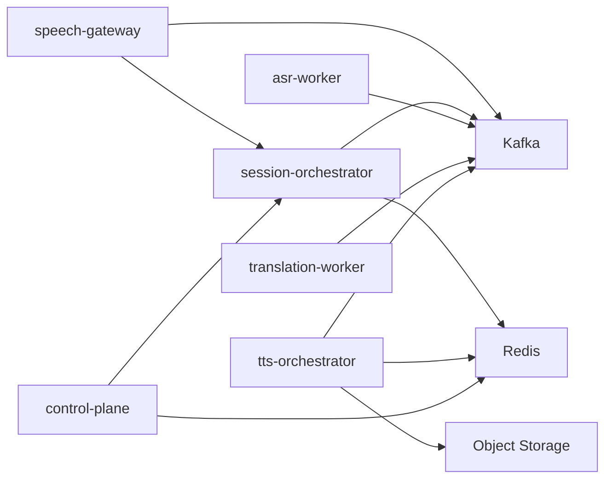

# Services

## 1. 推荐服务拆分

建议先拆成 6 个核心服务和 2 类基础设施能力。

### 核心服务

| 服务名 | 主要职责 | 是否第一阶段必需 |
| --- | --- | --- |
| `speech-gateway` | 长连接接入、鉴权、限流、协议适配、会话路由 | 是 |
| `session-orchestrator` | 会话状态机、事件编排、幂等、降级、策略执行 | 是 |
| `asr-worker` | FunASR 推理、partial/final 结果生成 | 是 |
| `translation-worker` | 文本翻译、术语增强、上下文处理 | 是 |
| `tts-orchestrator` | 文本归一化、缓存命中、请求合并、对象分发 | 否 |
| `control-plane` | 租户、策略、配置、灰度、治理后台 | 否 |

### 基础设施

| 组件 | 作用 |
| --- | --- |
| `Kafka` | 事件总线、削峰、解耦、可重放 |
| `Redis` | 会话状态、路由信息、幂等记录、热点缓存 |

## 2. 服务边界

### speech-gateway

只负责：

- 连接建立与保活
- 令牌校验与租户识别
- 请求速率限制
- 音频帧接收与转发
- 回传字幕或回放地址

不负责：

- 推理决策
- 复杂业务状态机
- 文本翻译逻辑
- TTS 缓存策略

### session-orchestrator

只负责：

- 会话生命周期
- 工作流编排
- 超时处理
- 结果聚合
- 重试和降级判断

不负责：

- 直接承载大规模长连接
- 直接运行 GPU 推理

### asr-worker

只负责：

- 管理模型上下文
- 执行音频分片识别
- 输出稳定或最终文本
- 上报识别质量和推理耗时

### translation-worker

只负责：

- 消费最终文本
- 调用 Spring AI / LLM / 规则引擎
- 输出翻译文本

### tts-orchestrator

只负责：

- 生成缓存键
- 判断是否命中已有音频
- 合并重复请求
- 调度 TTS 引擎
- 产出流式分片或对象存储地址

### control-plane

只负责：

- 管理业务配置
- 动态切换模型版本
- 控制灰度和熔断策略
- 维护租户维度配额

## 3. 通信方式建议

### 外部接入

- `WebSocket`
  适合实时语音上行与字幕下行。
- `HTTP`
  适合控制接口、查询接口、后台操作接口。

### 内部通信

- `Kafka`
  作为主异步总线。
- `gRPC` 或 `HTTP`
  仅用于少量同步控制面接口，不建议承载高频语音主链路。

## 4. 依赖关系建议



依赖规则：

- 高并发数据流优先经 Kafka。
- 高频音频帧只允许 `speech-gateway -> Kafka`，不允许 `speech-gateway -> session-orchestrator -> Kafka` 中转。
- 服务之间不要随意互相同步调用。
- 只有编排层和控制面允许持有更完整的业务视图。

## 5. 建议的工程目录结构

当仓库开始进入代码阶段后，建议按下面的结构组织：

```text
.
├─ README.md
├─ docs/
│  ├─ architecture.md
│  ├─ event-model.md
│  ├─ observability.md
│  ├─ roadmap.md
│  └─ services.md
├─ api/
│  ├─ openapi/
│  ├─ protobuf/
│  └─ json-schema/
├─ deploy/
│  ├─ docker/
│  ├─ k8s/
│  └─ monitoring/
├─ services/
│  ├─ speech-gateway/
│  ├─ session-orchestrator/
│  ├─ asr-worker/
│  ├─ translation-worker/
│  ├─ tts-orchestrator/
│  └─ control-plane/
├─ shared/
│  ├─ event-contracts/
│  ├─ common-model/
│  └─ test-fixtures/
└─ tools/
   ├─ load-test/
   └─ local-dev/
```

## 6. 第一阶段接口约束

在真正编码之前，建议先冻结以下契约：

- WebSocket 上行音频帧协议
- WebSocket 下行字幕协议
- 会话控制接口
- 统一事件 Envelope
- Topic 命名规范
- 错误码与降级码

## 7. 需要特别避免的拆分错误

- 把网关做成“超级服务”，同时负责接入、状态、推理与缓存
- 让 TTS 引擎直接暴露给外部业务
- 在没有统一事件头之前先各服务各自定义消息格式
- 过早做过细粒度微服务，导致编排复杂度先失控
