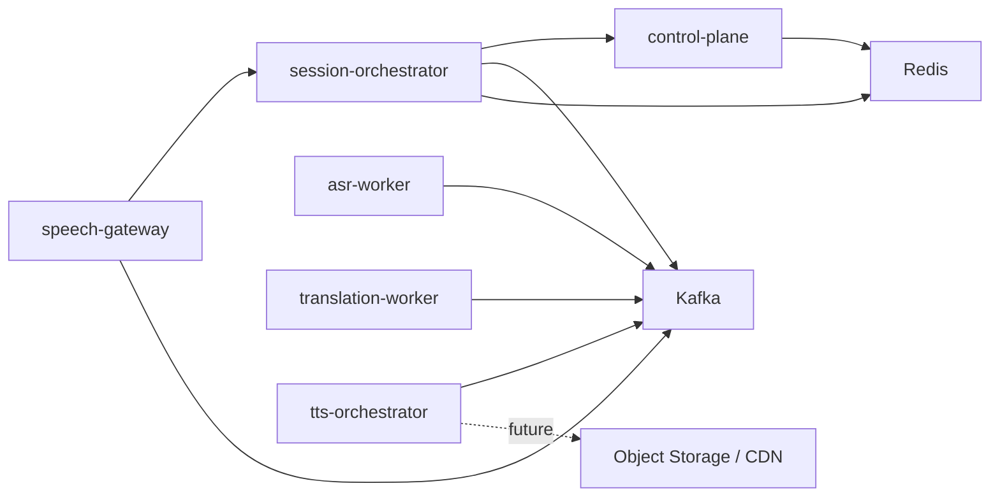

# Services

本文件同时描述两件事：

- 当前仓库里已经存在的服务模块和实现边界
- 这些服务在目标生产架构中的职责边界

当前落地状态的快速总览见 [implementation-status.md](implementation-status.md)。

## 1. 当前模块基线

仓库现在已经包含 6 个核心服务和 2 类基础设施依赖的工程骨架。

| 服务名 | 当前状态 | 当前已实现能力 | 主要依赖 |
| --- | --- | --- | --- |
| `speech-gateway` | 已落地骨架 | WebSocket 接入、Kafka 音频发布、会话 start/stop 转发、会话级限流/背压 | Kafka、`session-orchestrator` |
| `session-orchestrator` | 已落地骨架 | 会话生命周期 API、策略校验、Redis 状态、`session.control` 发布 | Redis、Kafka、`control-plane` |
| `asr-worker` | 已落地骨架 | 消费 `audio.ingress.raw`、默认 placeholder + 可切换 HTTP/FunASR ASR 适配、发布 `asr.partial` / `asr.final` | Kafka |
| `translation-worker` | 已落地骨架 | 消费 `asr.final`、默认 placeholder + 可切换 HTTP/OpenAI 翻译适配、发布 `translation.result` | Kafka |
| `tts-orchestrator` | 已落地骨架 | 消费 `translation.result`、voice/cacheKey 生成、可切换 HTTP TTS synthesis 适配、发布 `tts.request` | Kafka |
| `control-plane` | 已落地骨架 | 租户策略 HTTP API、Redis 存储、版本化 upsert | Redis |

基础设施：

| 组件 | 当前用途 |
| --- | --- |
| `Kafka` | 事件总线、主数据链路、模块解耦 |
| `Redis` | 会话状态、租户策略、后续幂等与缓存基础 |

## 2. 目标职责边界

### speech-gateway

目标职责：

- 长连接建立与保活
- 鉴权、租户识别、协议校验
- 高频音频帧接收与直接写 Kafka
- 回传字幕、错误和会话关闭事件

当前已经实现：

- `/ws/audio`
- `session.start` / `session.ping` / `audio.frame` / `session.stop`
- `audio.ingress.raw` 发布
- `audio.frame` 会话级限流与背压保护
- `session.error` 下行
- `asr.partial` -> `subtitle.partial`
- `translation.result` -> `subtitle.final`
- `session.control(status=CLOSED)` -> `session.closed`
- 下行链路顺序/终态/重复语义的仓库内 E2E 回归测试

当前未实现：

- 真正的鉴权
- 更完整的结果聚合和多路下行策略

### session-orchestrator

目标职责：

- 会话状态机
- 编排顺序、超时、幂等、重试、降级
- 汇聚 ASR / Translation / TTS 结果

当前已经实现：

- start/stop 生命周期 API
- 租户策略查询与校验
- 查询控制面的第一版熔断与缓存回退
- Redis 会话状态存储
- `session.control` Kafka 发布

当前未实现：

- 结果聚合
- 超时调度
- 补偿与降级工作流

### asr-worker

目标职责：

- 流式 ASR 推理
- 管理模型上下文
- 产出 `asr.partial` / `asr.final`

当前已经实现：

- `audio.ingress.raw` 消费
- 默认 placeholder 推理 + 可切换 HTTP/FunASR ASR 适配入口
- 按稳定度分流发布 `asr.partial` / `asr.final`（非稳定结果发 partial，稳定/终态结果发 final）
- `idempotencyKey` 判重与重复失败补偿信号基线

当前未实现：

- FunASR 生产联调与模型侧运行保障
- VAD/切段/上下文管理

### translation-worker

目标职责：

- 翻译、术语替换、上下文增强
- 产出字幕结果和后续 TTS 请求

当前已经实现：

- `asr.final` 消费
- 默认 placeholder 翻译 + 可切换 HTTP/OpenAI 翻译适配入口
- `translation.result` 发布
- `idempotencyKey` 判重与重复失败补偿信号基线

当前未实现：

- OpenAI 生产联调与模型侧运行保障
- glossary / context / fallback 策略

### tts-orchestrator

目标职责：

- 文本归一化
- 缓存键生成
- 重复请求合并
- TTS 引擎调度
- 分片或回放地址输出

当前已经实现：

- `translation.result` 消费
- 规则 voice 选择 + 可切换 HTTP voice-policy 适配入口
- 可切换 HTTP TTS synthesis 适配入口
- cacheKey 生成
- `tts.request` 发布
- `idempotencyKey` 判重与重复失败补偿信号基线

当前未实现：

- TTS synthesis 生产联调与模型侧运行保障
- `tts.chunk` / `tts.ready`
- 对象存储和 CDN 分发

### control-plane

目标职责：

- 租户、语言对、模型版本和配额管理
- 策略治理、灰度和熔断配置

当前已经实现：

- 租户策略的 GET / PUT API
- Redis 持久化抽象
- 版本化更新语义
- 灰度与控制面回退策略字段（canary percent / fail-open / cache ttl）

当前未实现：

- 认证鉴权
- 数据库持久化
- 跨服务动态策略分发

## 3. 当前通信方式

### 外部接入

- `WebSocket`
  当前用于 `speech-gateway` 的实时语音入口。
- `HTTP`
  当前用于 `session-orchestrator` 与 `control-plane` 的低频控制接口。

### 内部通信

- `Kafka`
  当前主异步总线，已落地 6 个 Topic。
  核心 consumer 已落地固定重试、`.dlq` 死信回退、`idempotencyKey` 判重和补偿信号基线。
- `HTTP`
  当前用于 `speech-gateway -> session-orchestrator` 和 `session-orchestrator -> control-plane` 的低频调用。

## 4. 当前依赖关系



依赖规则：

- 高频音频帧只允许 `speech-gateway -> Kafka`
- `session-orchestrator` 不承接高频音频帧
- 当前所有已落地 Topic 都按 `sessionId` 维持会话内顺序
- 服务间同步调用只保留低频控制面路径

## 5. 当前工程目录结构

仓库已经进入代码阶段，当前结构如下：

```text
.
├─ docs/
├─ api/
├─ deploy/
├─ services/
│  ├─ speech-gateway/
│  ├─ session-orchestrator/
│  ├─ asr-worker/
│  ├─ translation-worker/
│  ├─ tts-orchestrator/
│  └─ control-plane/
├─ shared/
└─ tools/
```

后续仍可继续补齐：

- `deploy/k8s`、监控看板、压测脚本
- `shared/event-contracts`、公共测试夹具
- TTS 分发与对象存储相关模块

## 6. 契约与实现边界

- 对外行为的权威定义仍然在 `contracts.md` 和 `api/`
- `services/*/README.md` 用于描述单模块当前范围
- 当目标职责与当前实现不一致时，优先显式写出“当前已实现 / 当前未实现”，不要混写成已经上线

## 7. 需要特别避免的拆分错误

- 把网关做成“超级服务”，同时承担接入、状态、推理与缓存
- 让编排层继续承担音频中转
- 在没有统一事件头和版本规则时让各服务自行扩展消息体
- 把还未落地的 TTS 分发、高级补偿/治理和压测能力写成已完成
