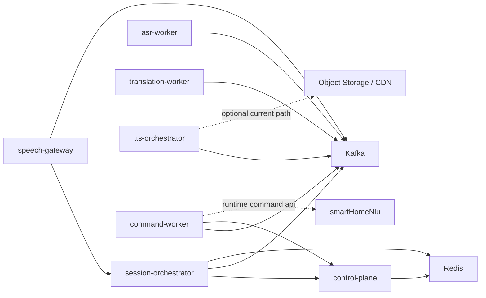

# Services

本文件同时描述两件事：

- 当前仓库里已经存在的服务模块和实现边界
- 这些服务在目标生产架构中的职责边界

当前落地状态的快速总览见 [implementation-status.md](implementation-status.md)。

## 1. 当前模块基线

仓库现在已经包含 7 个核心服务和 2 类基础设施依赖的工程骨架。

| 服务名 | 当前状态 | 当前已实现能力 | 主要依赖 |
| --- | --- | --- | --- |
| `speech-gateway` | 已落地骨架 | WebSocket 接入、可配置 WS token 鉴权、Kafka 音频发布、会话 start/stop 转发、会话级限流/背压、Kafka 驱动下行回推（`subtitle.*`/`tts.*`/`session.closed`）、下行 E2E 稳定性基线、客户端可感知时延指标基线（first/final/tts.ready）、客户端播放阶段指标上报（`playback.metric`）与网关指标聚合 | Kafka、`session-orchestrator` |
| `session-orchestrator` | 已落地骨架 | 会话生命周期 API、策略校验、Redis 状态、`session.control` 发布、`asr.partial/asr.final/translation.result/tts.ready/command.result` 聚合、idle/hard timeout 自动关闭与补偿信号基线 | Redis、Kafka、`control-plane` |
| `asr-worker` | 已落地骨架 | 消费 `audio.ingress.raw`、默认 placeholder + 可切换 HTTP/FunASR ASR 适配、VAD 静音切段、发布 `asr.partial` / `asr.final`、FunASR 第一版生产联调基线 | Kafka |
| `translation-worker` | 已落地骨架 | 两段式消费与发布：`asr.final -> translation.request -> translation.result`，默认 placeholder + 可切换 HTTP/OpenAI 翻译适配，OpenAI 适配已具备 health 探测、并发保护、错误语义映射与引擎级指标 | Kafka |
| `tts-orchestrator` | 已落地骨架 | 消费 `translation.result`（`TRANSLATION`）与 `command.result`（`SMART_HOME`）、voice/cacheKey 生成、可切换 HTTP TTS synthesis 适配、发布 `tts.request` / `tts.chunk` / `tts.ready`、可配置 S3/MinIO 上传并回填 `tts.ready.playbackUrl`、可配置 CDN `cache-control`/URL 签名/区域路由/回源回退、cache scope/shard 策略，HTTP synthesis 适配已具备 health 探测、并发保护、错误语义映射与引擎级指标 | Kafka |
| `command-worker` | 已落地骨架 | 消费 `asr.final`（仅 `SMART_HOME`）与 `command.confirm.request`、调用 smartHomeNlu `/api/v1/command` + `/api/v1/confirm`、发布 `command.result`、租户策略驱动重试/DLQ、幂等与补偿信号基线 | Kafka、`control-plane`、smartHomeNlu |
| `control-plane` | 已落地骨架 | 租户策略 HTTP API、可配置 Bearer Token 鉴权/授权（读写 + 租户范围）、`control.auth.mode=static/external-iam/hybrid` 鉴权后端切换、JWKS 外部 IAM 校验后端骨架、Redis 存储、版本化 upsert/rollback（支持 `targetVersion` / `distributionRegions`）、策略历史快照、`tenant.policy.changed` 发布 | Redis、Kafka |

基础设施：

| 组件 | 当前用途 |
| --- | --- |
| `Kafka` | 事件总线、主数据链路、模块解耦 |
| `Redis` | 会话状态、租户策略、后续幂等与缓存基础 |

## 2. 目标职责边界

### speech-gateway

目标职责：

- 长连接建立与保活
- 鉴权、租户识别、协议校验
- 高频音频帧接收与直接写 Kafka
- 回传字幕、错误和会话关闭事件

当前已经实现：

- `/ws/audio`
- 可配置 WS token 鉴权（`Authorization: Bearer <token>` 或 query `access_token`）
- `session.start` / `session.ping` / `audio.frame` / `session.stop` / `command.confirm` / `playback.metric`
- `audio.ingress.raw` / `command.confirm.request` 发布
- `audio.frame` 会话级限流与背压保护
- `session.error` 下行
- `asr.partial` -> `subtitle.partial`
- `translation.result` -> `subtitle.final`
- `command.result` -> `command.result`
- `tts.chunk` -> `tts.chunk`
- `tts.ready` -> `tts.ready`
- `session.control(status=CLOSED)` -> `session.closed`
- 下行链路顺序/终态/重复语义的仓库内 E2E 回归测试
- 客户端可感知时延指标：`session.start -> first subtitle / final subtitle / tts.ready`
- 客户端播放阶段指标：`playback start / stall / complete / fallback`

当前未实现：

- 外部 IAM/RBAC 集成与租户级凭据治理
- 更完整的结果聚合和多路下行策略

### session-orchestrator

目标职责：

- 会话状态机
- 编排顺序、超时、幂等、重试、降级
- 汇聚 ASR / Translation / TTS 结果

当前已经实现：

- start/stop 生命周期 API
- 租户策略查询与校验
- 查询控制面的第一版熔断与缓存回退
- 消费 `tenant.policy.changed` 并刷新本地策略缓存
- Redis 会话状态存储
- `session.control` Kafka 发布
- 消费 `asr.partial` / `asr.final` / `translation.result` / `tts.ready` / `command.result` 更新会话聚合进度
- idle/hard timeout 定时扫描与自动 `session.stop` 编排（`session.control(status=CLOSED)`）
- stalled 阶段（`post_final` / `post_translation`）检测与自动 `session.stop` 编排
- timeout/stalled 触发补偿信号发布（`ops.compensation -> platform.compensation`，并双写 `platform.audit`）
- 跨服务补偿 Saga v1 执行入口（`tools/platform-compensation-saga.sh`，动作路由：`replay | session-close | manual`）
- `platform.dlq` 实时补偿 Saga v2 消费（动作重试、Redis 幂等状态、审计发布）

当前未实现：

- 强一致跨服务补偿事务编排与降级工作流

### asr-worker

目标职责：

- 流式 ASR 推理
- 管理模型上下文
- 产出 `asr.partial` / `asr.final`

当前已经实现：

- `audio.ingress.raw` 消费
- 默认 placeholder 推理 + 可切换 HTTP/FunASR ASR 适配入口
- FunASR 响应兼容与错误语义加固（`sentences` / 字符串数值 / 0-1 final 标记 / provider code 校验）
- 按稳定度 + VAD 切段分流发布 `asr.partial` / `asr.final`（非稳定结果发 partial，稳定/终态/VAD 命中结果发 final）
- FunASR 生产联调基线（可配置 health 探测、并发上限保护、错误码语义映射、引擎级指标）
- 按租户策略驱动重试参数与 DLQ 后缀（控制面不可用时回退到本地默认）
- 消费 `tenant.policy.changed` 并刷新本地策略缓存
- `idempotencyKey` 判重与重复失败补偿信号基线

当前未实现：

- FunASR 真实集群联调与模型侧运行保障（容量压测、故障演练、弹性回收）
- 高级上下文窗口管理与多语种细粒度切段策略

### translation-worker

目标职责：

- 翻译、术语替换、上下文增强
- 产出字幕结果和后续 TTS 请求

当前已经实现：

- `asr.final` 消费并发布 `translation.request`
- 默认 placeholder 翻译 + 可切换 HTTP/OpenAI 翻译适配入口
- OpenAI 响应兼容与错误语义加固（content 数组/Responses output 兼容、`error` 与失败 `status` 快速失败）
- OpenAI 生产联调基线（可配置 health 探测、并发上限保护、错误码语义映射、引擎级指标）
- `translation.request` 消费并发布 `translation.result`
- 按租户策略驱动重试参数与 DLQ 后缀（控制面不可用时回退到本地默认）
- 消费 `tenant.policy.changed` 并刷新本地策略缓存
- `idempotencyKey` 判重与重复失败补偿信号基线

当前未实现：

- OpenAI 真机容量/故障演练与模型侧运行保障（真实配额、限流与故障演练）
- glossary / context / fallback 策略

### tts-orchestrator

目标职责：

- 文本归一化
- 缓存键生成
- 重复请求合并
- TTS 引擎调度
- 分片或回放地址输出

当前已经实现：

- `translation.result` 消费（仅 `sessionMode=TRANSLATION`）
- `command.result` 消费（仅 `sessionMode=SMART_HOME`）
- 规则 voice 选择 + 可切换 HTTP voice-policy 适配入口
- 可切换 HTTP TTS synthesis 适配入口
- TTS synthesis 响应兼容与错误语义加固（`code/status` 校验、`error` 快速失败、boolean-like stream 兼容）
- TTS synthesis 生产联调基线（可配置 health 探测、并发上限保护、错误码语义映射、引擎级指标）
- cacheKey 生成
- `tts.request` / `tts.chunk` / `tts.ready` 发布
- `tts.ready` 对应音频对象上传（`tts.storage`：`none` / `s3`，支持 MinIO path-style）
- 上传对象 `cache-control` 策略和 `expires/sig` 回放 URL 签名（配置化）
- 按租户区域映射的 CDN 路由与区域缺失时 origin 回退（配置化）
- 可配置 cache scope（tenant/global）与 shard 路径前缀（缓存命中优化）
- 按租户策略驱动重试参数与 DLQ 后缀（控制面不可用时回退到本地默认）
- 消费 `tenant.policy.changed` 并刷新本地策略缓存
- `idempotencyKey` 判重与重复失败补偿信号基线

当前未实现：

- TTS synthesis 真机容量/故障演练与模型侧运行保障（真实配额、限流与故障演练）
- 对象存储高可用治理与更高级 CDN 缓存治理

### command-worker

目标职责：

- 智能家居命令执行编排（非翻译链路）
- 接收识别终态和用户确认事件
- 调用 smartHomeNlu 并发布命令回执事件

当前已经实现：

- 消费 `asr.final`，仅在租户策略 `sessionMode=SMART_HOME` 时处理
- 消费 `command.confirm.request`（二次确认提交）
- 调用 smartHomeNlu `/api/v1/command` 与 `/api/v1/confirm`
- 发布 `command.result`
- 按租户策略驱动重试参数与 DLQ 后缀（控制面不可用时回退到本地默认）
- 消费 `tenant.policy.changed` 并刷新本地策略缓存
- `idempotencyKey` 判重与重复失败补偿信号基线

当前未实现：

- smartHomeNlu 真实环境容量/故障演练与运行保障

### control-plane

目标职责：

- 租户、语言对、模型版本和配额管理
- 策略治理、灰度和熔断配置

当前已经实现：

- 租户策略的 GET / PUT / POST 回滚 API（`/policy:rollback` 支持回滚上一版本或指定 `targetVersion`，并可附带 `distributionRegions`）
- `/api/v1/tenants/**` 的 Bearer Token 鉴权与授权（读/写权限 + 租户范围）
- `control.auth.mode` 模式切换（`static` / `external-iam` / `hybrid`）与 JWKS 外部 IAM 校验后端骨架
- 鉴权决策/耗时/回退指标（`controlplane.auth.decision.total` / `controlplane.auth.decision.duration` / `controlplane.auth.hybrid.fallback.total`）
- 真实 IAM 对接准备层（`deploy/env/control-plane-iam.env.template` + `tools/control-plane-iam-precheck.sh`）
- Redis 持久化抽象
- 版本化更新语义（upsert 与 rollback 均递增版本）
- 策略历史快照（用于回滚到上一版本）
- 灰度与控制面回退策略字段（canary percent / fail-open / cache ttl）
- 可靠性策略字段（`retryMaxAttempts` / `retryBackoffMs` / `dlqTopicSuffix`）
- 策略 upsert / rollback 后发布 `tenant.policy.changed`

当前未实现：

- 外部 IAM/RBAC 提供方联调与生产级运行保障（真实 issuer/audience/JWKS、故障策略、运营监控）
- 数据库持久化
- 高级动态策略治理（跨区域分发、版本编排、回滚编排）
- 已支持指定版本回滚与跨区域分发意图发布（`targetVersion` / `distributionRegions`）；跨区域实际执行链路仍待落地

## 3. 当前通信方式

### 外部接入

- `WebSocket`
  当前用于 `speech-gateway` 的实时语音入口。
- `HTTP`
  当前用于 `session-orchestrator` 与 `control-plane` 的低频控制接口。

### 内部通信

- `Kafka`
  当前主异步总线，已落地 12 个 Topic（新增 `translation.request`、`tenant.policy.changed`、`command.confirm.request`、`command.result`）。
  核心 consumer 已落地 `.dlq` 死信回退、`idempotencyKey` 判重和补偿信号基线；`asr-worker`、`translation-worker`、`tts-orchestrator`、`command-worker` 已升级到租户策略驱动重试/DLQ。
- `HTTP`
  当前用于 `speech-gateway -> session-orchestrator`、`session-orchestrator -> control-plane` 与 `command-worker -> smartHomeNlu` 调用。

## 4. 当前依赖关系



依赖规则：

- 高频音频帧只允许 `speech-gateway -> Kafka`
- `session-orchestrator` 不承接高频音频帧
- 主链路 Topic 按 `sessionId` 维持会话内顺序；治理事件 `tenant.policy.changed` 按 `tenantId` 路由
- 服务间同步调用只保留低频控制面路径

## 5. 当前工程目录结构

仓库已经进入代码阶段，当前结构如下：

```text
.
├─ docs/
├─ api/
├─ deploy/
├─ services/
│  ├─ speech-gateway/
│  ├─ session-orchestrator/
│  ├─ asr-worker/
│  ├─ translation-worker/
│  ├─ tts-orchestrator/
│  ├─ command-worker/
│  └─ control-plane/
├─ shared/
└─ tools/
```

后续仍可继续补齐：

- `deploy/k8s`、监控看板、压测脚本
- `shared/event-contracts`、公共测试夹具
- TTS 分发与对象存储相关模块

## 6. 契约与实现边界

- 对外行为的权威定义仍然在 `contracts.md` 和 `api/`
- `services/*/README.md` 用于描述单模块当前范围
- 当目标职责与当前实现不一致时，优先显式写出“当前已实现 / 当前未实现”，不要混写成已经上线

## 7. 需要特别避免的拆分错误

- 把网关做成“超级服务”，同时承担接入、状态、推理与缓存
- 让编排层继续承担音频中转
- 在没有统一事件头和版本规则时让各服务自行扩展消息体
- 把还未落地的高级补偿/治理、真实容量实战证据和跨区域执行链路写成已完成
